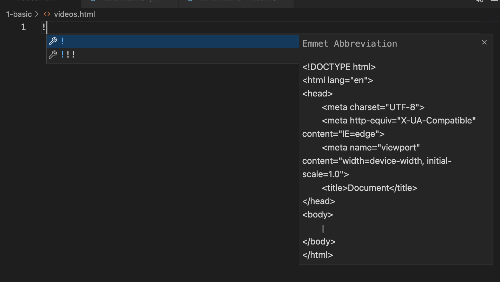
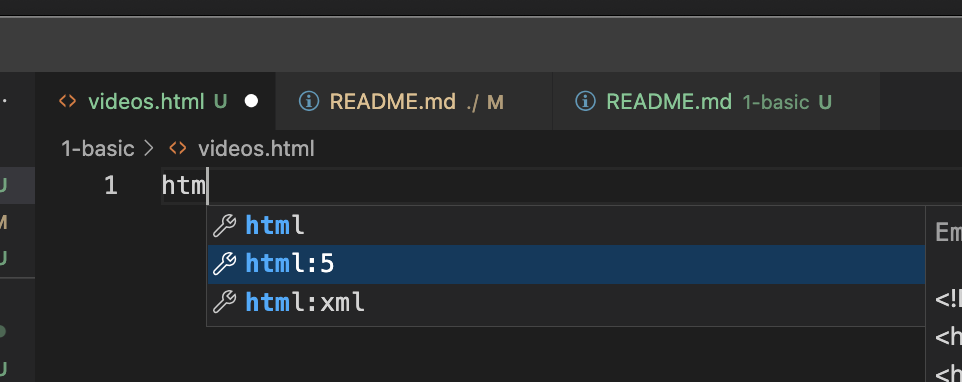
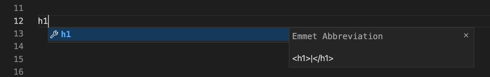

# Basic Items 

### HTML Boilerplate / Snippet

Visual Studio can generate HTML boilerplate by typing `!` and press <kbd>Tab</kbd> key in the keyboard 

or type `html` and then choose `html:5`

The auto-completions works on **Tab** as well, type `h1`

